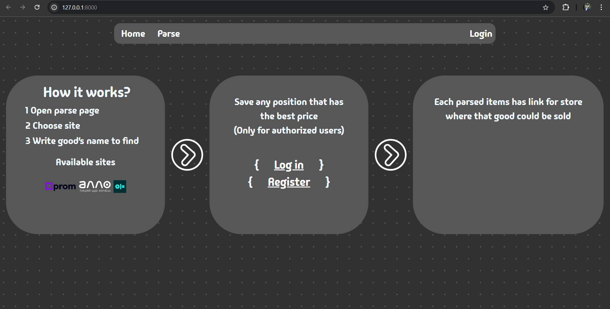
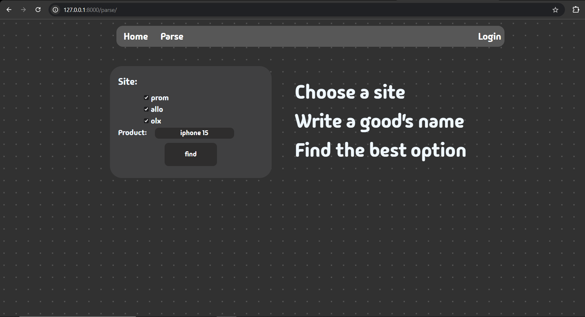
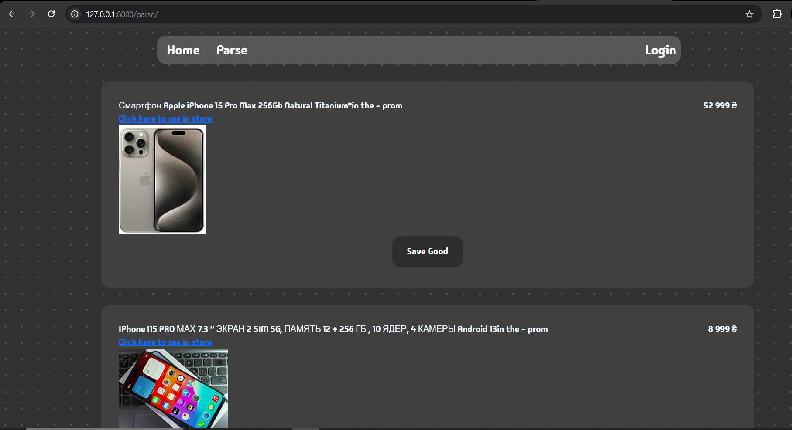

# About the project

## Description
This asynchronous __web scraper__ collects information about products from multiple stores, including details such as the URL, image, and price. Users can choose from three available stores and submit a request by specifying the name of the product they are looking for. In response, the scraper provides a comprehensive list of offers from the selected stores.

Additionally, users who are logged in can save specific products to their profile for later review using the saving feature.

### Table of content
- [Quick start](#run-project)
- [Technology Stack](#built-with)
- [Configuration Setup](#setup-project)
- [Product Scraping Service (services.py)](#core-service-functionality)
    - [Parse class](#parse-class)
    - [Constructor( \__init__ )](#constructor)
    - [__get_full_url method](#__get_full_url-method)
    - [fetch method](#fetch-method)
    - [scrape_data method](#scrape_data-method)
    - [fetch_site_data method](#fetch_site_data-method)
    - [make_request method](#make_request-method)
- [Parse view function](#parse-view-function)
- [Authentication](#Authentication)


#### Run project
Execute ```python manage.py runserver``` from directory where __manage.py__ is located([installed dependencies required](#setup-project)).

Open __parse page__ in header link or write url manually(```parse/```), choose any site and write good's name to search. Press find button.
Response:

#### Built with 
- [Django](https://www.djangoproject.com/) -is a free and open-source, Python-based web framework that runs on a web server.
- [Beautifulsoup4](https://tedboy.github.io/bs4_doc/) - is a Python library for pulling data out of HTML and XML files. 
- [Aiohttp](https://docs.aiohttp.org/en/stable/) - Asynchronous HTTP Client/Server for asyncio and Python.
- ~~Requests~~(changed later by asynchronous library).

#### Setup project
Install dependencies (you should have [pipenv](https://pipenv.pypa.io/en/latest/) installed):
```pipenv install```
Activate virtual environment: 
```pipenv shell```
Perform migration:
```python manage.py makemigrations```
```python manage.py migrate```

### Core Service Functionality

The ```services.py``` file provides the core logic for scraping product data from three e-commerce websites - [Allo](https://allo.ua/), [OLX](https://www.olx.ua/uk/), and [Prom](https://prom.ua/ua/) — using asynchronous HTTP requests. It leverages the aiohttp library to fetch data and BeautifulSoup from bs4 to parse the HTML content of the pages. The class structure and key methods are designed to scrape product names, prices, URLs, and images.

##### Parse class
The Parse class serves as the main scraping engine. It initializes with a list of stores and the product name to search for. It contains four dictionaries that store the site-specific CSS classes used to extract product information:
```python
    site_classes_of_names = {
        "site-name": "css class name"
    }
    site_classes_of_price= {
        ...
    }
    site_classes_of_url= {
        ...
    }
    site_classes_of_images= {
        ...
    }
```
These ensure the scraper targets the right elements on each page based on the site structure. 

##### Constructor
Upon instantiation, the constructor initializes ```self.data``` — a dictionary storing lists for each site (names, prices, URLs, and images). It also constructs full URLs for each site by calling the private method ```__get_full_url```. The URLs are stored in ```self._url``` for easy reference during the scraping process.

##### __get_full_url method
This private method generates a search URL specific to each site by formatting the product name into a query string. Each site has a unique format:
- For Prom, the product is passed as a ```search_term``` parameter.
- For Allo, the search term is appended after ```/catalogsearch/result/```.
- For OLX, the spaces in the product name are replaced with hyphens to fit their URL structure.

##### fetch method
The ```fetch``` method sends an asynchronous GET request to the given URL using ```aiohttp```. It retrieves the HTML content of the page, which is later parsed.

##### scrape_data method
This method processes the HTML content returned by the ```fetch``` method. Using ```BeautifulSoup```, it extracts product names, prices, URLs, and images based on the CSS classes stored in the dictionaries. The method handles site-specific logic, such as OLX requiring a special approach to extract URLs and images.

##### fetch_site_data method
This method coordinates fetching and scraping for each site. It retrieves the HTML content using ```fetch``` and parses it using ```scrape_data```.

##### make_request method
The ```make_request``` method coordinates the asynchronous fetching of data from all sites. It creates a list of tasks, each corresponding to a different site, and runs them concurrently using ```asyncio.gather```. This enables the scraper to retrieve product data from multiple sites in parallel, improving the speed and efficiency of the scraping process.

#### Parse view function

The parse view handles the logic for processing product search requests. When the user submits the search form via a __POST__ request, the view retrieves the form data and validates it using the ```SearchForm```. If the form is valid, it initializes the ```Parse``` class with the selected sites and product name.

The asynchronous scraping process (```make_request```) is triggered using ```async_to_sync``` to run synchronously within the view. The scraped data (product names, prices, URLs, and images) is then combined into a context list, which is passed to the template (```home.html```) to display the results to the user.

This view allows users to request product information from selected e-commerce sites and presents the results in a formatted way on the front-end.

#### Authentication

The project includes a user authentication system that allows users to sign up and log in. The ```sign_up``` view handles the registration process by using a custom ```RegisterForm```. When a user submits the form and the input is valid, a new user account is created. The user is automatically logged in using Django’s built-in ```login()``` function and redirected to the home page.

This system ensures that only registered users can access certain features, such as saving product data for later viewing. It streamlines the authentication process by allowing users to sign up and immediately use their account without needing to log in again.

The authentication logic is built upon Django's built-in auth framework, ensuring security and easy management of user sessions.